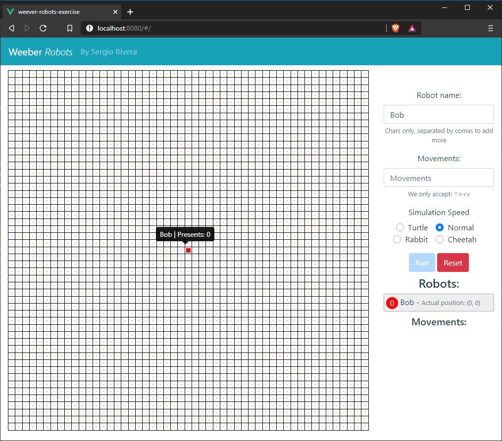

# weever-robots-exercise

By *Sergio Rivera* - 2020-04-10


I chose to code this challenge in Vue: https://weeverapps.github.io/interviews/robot.html  

I am creating a grid of 51 by 51 squares to simulates the houses and the robots are moving arroung that grid.

Even if the robots moves outside the grid, I am still adding "hidden" houses to put/count the correct presents


## Screens:

**Home**



You are presented with a Grid that simulates the Houses and a default robot called Bob is placed at the center of the grid 
at position (0,0)

You can add new robots by separating then with a comma ``,``

Insert your movements to move right ``>`` , left ``<`` , up ``^``  or down ``v``  or ``V`` 

Then chose yous speed: ``turtle``, ``normal`` ``rabbit`` or ``cheetah`` 

Press on ``Run`` 

**Running the simulation**


The simulations is running and moving the Robots arround the grid based on the movements (Little squares with random colors)

I show the wich robot should move and what movement should be done.

I am also showing the current Robot position on the grid.

**End running**


The simulation has now ended and you can see how many presents are delivered in total.

You can also query how many presents to search for houses that has at least ``n``  qty of presents:


## Project setup
To install modules
```
npm install
```

### Compiles and hot-reloads for development
To run the project
```
npm run serve
```
Then go to http://localhost:8080/ to see the solution live

### Compiles and minifies for production
```
npm run build
```